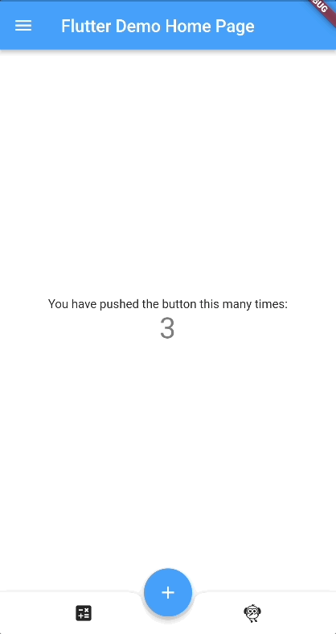
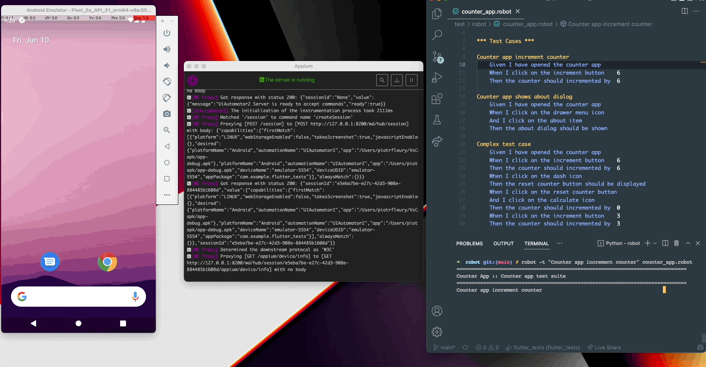

# flutter_tests

A Flutter project made to run End to End tests with RobotFramework.



## Getting Started

This project is a starting point for a Flutter application.

A few resources to get you started if this is your first Flutter project:

- [Lab: Write your first Flutter app](https://flutter.dev/docs/get-started/codelab)
- [Cookbook: Useful Flutter samples](https://flutter.dev/docs/cookbook)

For help getting started with Flutter, view our
[online documentation](https://flutter.dev/docs), which offers tutorials,
samples, guidance on mobile development, and a full API reference.

## RobotFramework

[RobotFramework](https://robotframework.org/) is required to run End to End tests on Flutter mobile app

## Appium

[Appium server](https://appium.io/) is required to pilot mobile device and run End to End tests

## Libraries

We use several libraries to create End to End tests

[AppiumLibrary](https://github.com/serhatbolsu/robotframework-appiumlibrary)

[OCRLibrary](https://pypi.org/project/robotframework-ocrlibrary/)

[Collections](http://robotframework.org/robotframework/latest/libraries/Collections.html)

## Run E2E tests

Go in the `test/robot` directory

And run the folowwing command

```bash
robot counter_app.robot
```

## Run single test case

```bash
robot -t "Complex test case" counter_app.robot
```



## Open HTML report

RobotFramework generates test execution HTML report. By default the report is generated next to the `*.robot` file in `report.html` file.


<a href="./test/robot/report.html">Open Report</a>

# Run Flutter tests

## Flutter Tests location

### Unit tests

    - `test/unit/counter_controller_test.dart`

### Widget tests

    - `test/widget/widget_test.dart`

### Golden tests

    - `test/golden/home_page_golden_test.dart`

### Integration tests

    - `integration_test/app_test.dart`

## Run all tests

```bash
flutter test
``` 

## Update Gloden files

```bash
flutter test --update-goldens
```

## Run Integration tests

```bash
flutter test integration_test
```
